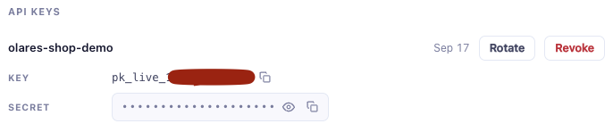
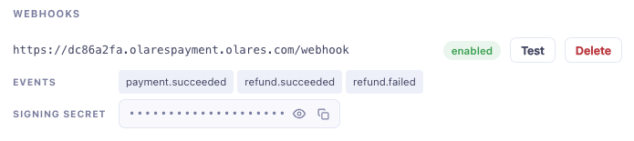

# Build with AI agents

This guide shows how to use an AI agent to build a store demo with Olares Payment integrated and publish it to Olares OS — that is, quickly create an online store that accepts payments and is accessible from anywhere.

## Prerequisites

- **AI agent**: any AI coding agent, such as Codex, Claude Code, Cursor, or DeepSeek Harness.
- **olares-cli and Agent Skills**: installed. See [Install olares-cli](../cli-install) and [Install and use Agent Skills](../cli-agent-skills).
- **Logged in to Olares**: see [Log in to Olares](../cli-log-in). A successful login looks like this:

  

- **Olares Payment merchant account and API keys**: you have signed in to the [Olares Payment Dashboard](https://www.olares.com/payment/dashboard/) with LarePass (first sign-in creates your merchant account automatically), and created a key pair under **Checkouts → Advanced settings → API keys**, giving you `pk_live_…` and `sk_live_…`. For details, see the first two steps of the [Quickstart](./quickstart).

  

- **Docker**: logged in to a public registry on your machine, needed to push the app image in step 4.

## Steps

### 1. Create a repository and save your keys

Create a new git repository, write the keys into `.env` (leave the webhook signing secret empty for now), and add `.env` to `.gitignore`:

```bash
mkdir my-store && cd my-store
git init
echo ".env" >> .gitignore
```

```bash
# .env
PAYMENT_API_KEY=pk_live_…
PAYMENT_API_SECRET=sk_live_…
PAYMENT_WEBHOOK_SECRET=   # filled in after registering the webhook in step 5
```

::: warning Key safety
Throughout the whole flow, keys live in exactly three places: your local `.env`, the merchant dashboard, and the app's environment variables on Olares. Never write them into code or commit them to git. If a key ever entered git history, rotate it in the merchant dashboard.
:::

### 2. Open the repository with your agent

Use this repository as the agent's working directory: start your agent CLI (such as `codex` or `claude`) inside the repo, or open the folder in Cursor.

### 3. Create the store

Send the following prompt to the agent:

```text
Build a minimal online store demo (Node.js): one product page, one order endpoint,
and one order result page.
Accept payments with Olares Payment:
- On order, call createPayment to create a payment, return the checkoutUrl to the
  frontend, and redirect to the hosted checkout
- Expose a /webhook endpoint that receives payment.succeeded and marks the order
  as paid after signature verification
- Read credentials from .env (PAYMENT_API_KEY / PAYMENT_API_SECRET /
  PAYMENT_WEBHOOK_SECRET); never hardcode them. Leave the webhook signing secret
  empty for now — it gets filled in after deployment

Payment API docs: https://doc-review.mdogs.me/developer/payment/llms-full.txt
```

<!-- Before publishing: switch the llms-full.txt link in the prompt above back to the production URL https://www.olares.com/docs/developer/payment/llms-full.txt (currently 404 in prod; pointing at the review site for now) -->

The agent reads the API docs, does the integration, and gets it running on its own. Once order creation and the checkout redirect work locally, move on to the next step.

### 4. Package as an Olares app and install

Send the following prompt to the agent:

```text
Package this store as an Olares app and install it on my Olares OS:
- Build the image and push it to a public registry
- Scaffold the chart: public entrance, payment credentials as configurable
  environment variables
- Upload and install, then tell me the store's URL
```

The operational details of packaging and installation (chart scaffolding, lint, upload, install, status checks) are covered by skills like `olares-chart` and `olares-market`. The agent reads them as needed — no step-by-step coaching from you.

### 5. Configure the webhook

After installation, the agent gives you the store's URL (a stable domain assigned by Olares). Register a webhook with that domain in the merchant dashboard so the store can receive payment success notifications:

1. Go to **Checkouts → Advanced settings → Webhooks**, set the webhook URL to `https://<store-domain>/webhook`, and save. This generates the signing secret `whsec_…`.

   

2. Fill the signing secret into your local `.env` file yourself (`PAYMENT_WEBHOOK_SECRET=whsec_…`), then let the agent read it and sync it to the app:

   ```text
   The webhook signing secret is now in .env. Configure it into the store app's
   environment variables and restart the app so it takes effect.
   ```

For webhook signature verification, retries, and debugging, see [Webhooks](./webhooks).

### 6. Verify the store

Open the store URL and place a test order: redirect to the checkout, pay, return to the store, and see the order marked as paid — the full loop works. The URL is a stable domain assigned by Olares, so the store is accessible from anywhere.

To see what the finished product looks like, check out our example: [olares-payment-developer-example](https://github.com/beclab/olares-payment-developer-example) is a complete demo built with this exact flow, covering ordering, checkout, webhook, and refunds. Its live instance at <https://dc86a2fa.olarespayment.olares.com/> runs on Olares OS — open it and place an order.
