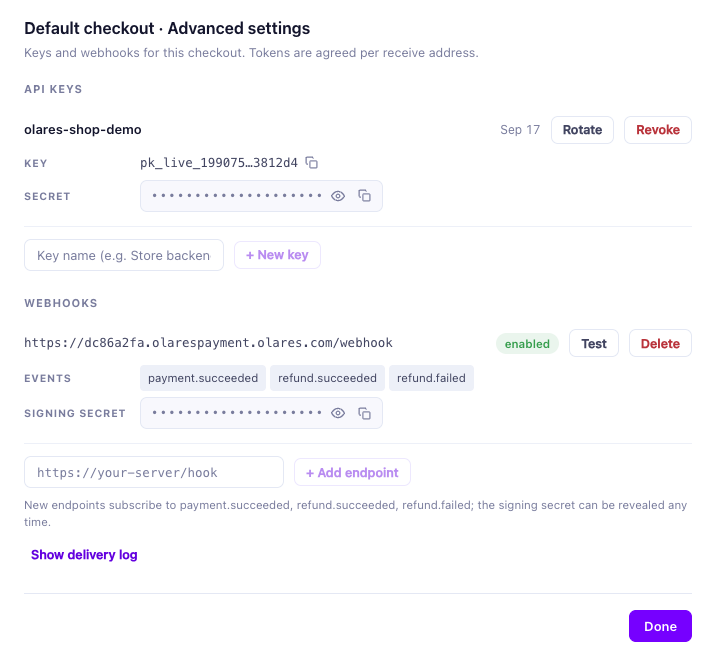
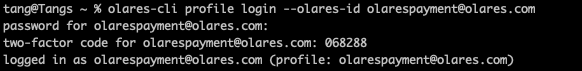

# 用 AI 智能体构建

你的 AI 智能体可以为你完成两件事：**把 Olares Payment 集成进你的 web 应用**，并**把它部署成你 Olares 集群上可安装的应用**——固定域名、密钥进集群 Secret、webhook 闭环。

这不是"给智能体一个链接看它自学"，而是给它真实的工具和权限，再交给它一份任务剧本。本文就是这份剧本。

## 开始前

### 装备

智能体的"大脑"是 Agent Skills（每个 skill 是一本操作手册，告诉它每组命令的作用、参数和常见错误），"手臂"是 `olares-cli`。安装和登录都是一次性的，按官方文档操作即可：

- [安装 olares-cli](../cli-install)——`npx @olares/cli@latest install` 一次装好 CLI 和 Skills
- [安装与使用 Agent Skills](../cli-agent-skills)
- [登录 Olares](../cli-log-in)

### 两把钥匙（人来做，只做一次）

| 钥匙 | 操作 | 打通的通路 |
| --- | --- | --- |
| 商户密钥 | [商户后台](https://www.olares.com/payment/dashboard/) → Checkouts → Advanced settings → API keys，拿到 `pk_live_…` / `sk_live_…` / `whsec_…` | 支付通路 |
| 集群 | `olares-cli profile login --olares-id <你的 Olares ID>` | 集群通路 |





两把钥匙齐了，剩下的都可以交给智能体。

### 支付知识的两个来源

<!-- 发布前：llms-full.txt 两处链接切回生产地址 https://www.olares.com/docs/developer/payment/llms-full.txt（当前生产 404，暂用 review 站） -->
- **课本**：[llms-full.txt](https://doc-review.mdogs.me/developer/payment/llms-full.txt)——全部支付文档打包成一份 Markdown，智能体一次读完即掌握整个 API。
- **参考实现**：[olares-payment-developer-example](https://github.com/beclab/olares-payment-developer-example)——同一套知识的可运行版本。

一个是课本，一个是习题答案：智能体读课本学 API，照着参考实现少犯错。

## 主线一：集成 Olares Payment

支付集成的本质只有两件事：

1. **给买家一个收银台**——`createPayment` 返回 `checkoutUrl`，币种、网络、钱包连接都由托管收银台处理；
2. **确认到账再履约**——webhook 实时推送 `payment.succeeded`，或者更简单：每隔几秒调一次 `getPayment` 轮询。两条路殊途同归，只有 `paid: true` 才是履约信号——webhook 适合实时响应，轮询适合最小 demo。

### 让智能体来做集成

把课本交给它就行。[llms-full.txt](https://doc-review.mdogs.me/developer/payment/llms-full.txt) 是全部支付文档的打包，智能体一次读完就掌握了整个 API——HMAC 认证、建支付单、webhook 验签、错误码和重试。然后你用大白话描述需求：

> 给我的 Node 服务加一个下单接口：调 `createPayment` 拿 `checkoutUrl` 返回给前端；再起一个 `/webhook` 接收 `payment.succeeded`，把订单标记为已支付。密钥从环境变量读。

它读文档、写代码、跑起来，你在旁边看。

### 我们已经做了一个

其实不用从零开始——上面这个过程，我们自己先跑了一遍，产物是一个完整的 demo 商店：[olares-payment-developer-example](https://github.com/beclab/olares-payment-developer-example)。下单、收银台、webhook、退款的闭环都在，`examples/` 目录里五个操作各有一个独立脚本，密钥全部走环境变量。克隆、填密钥、`npm install && npm start` 就能跑。

接下来的主线二，我们就拿这个仓库做部署演示。

## 主线二：打包成 Olares 应用

把 web 应用变成 Olares 应用，本质是产出两样东西：**一个镜像**（应用本体，推到公共仓库，节点匿名可拉），和**一个 chart**（告诉 Olares 怎么装：入口、密钥、资源）。

操作的细节不用你教——`olares-chart`、`olares-market`、`olares-settings` 这些 skill 里都有，智能体读了就会：怎么从 docker-compose 生成 chart 骨架、怎么 lint / package / upload / install、怎么读应用状态。

另外一件太常规、没资格算"钥匙"的事：镜像要推到公共仓库，所以智能体推送时需要你的本地 docker 已 `docker login`——就这一句。

部署完成后长什么样？看我们的实例：<https://dc86a2fa.olarespayment.olares.com/>——一个跑在 Olares 上的真实店铺，可以当场打开下一单。

## 总控提示词

装备和两把钥匙就绪后，把下面这段交给你的智能体：

```text
You are deploying my Olares Payment integration as an installable app on my
Olares cluster.

Already set up (do not redo): olares-cli + Agent Skills installed and logged
in; docker logged in to a public registry. My merchant keys are in my shell
env: PAYMENT_API_KEY / PAYMENT_API_SECRET / PAYMENT_WEBHOOK_SECRET.

Knowledge sources:
- Payment API docs (full bundle):
  https://doc-review.mdogs.me/developer/payment/llms-full.txt
- Reference implementation:
  https://github.com/beclab/olares-payment-developer-example
- Load skills: olares-shared, olares-chart, olares-market, olares-settings,
  olares-cluster.

Mission:
1. Start from the reference repo (or my existing app). Ensure:
   - secrets come from env only; nothing in code, image, or git
   - returnUrl derives from x-forwarded-proto / x-forwarded-host at runtime
   - tsx is in dependencies; start with `npx tsx server.js`
2. Write a Dockerfile (node:22-slim; COPY vendor before npm ci; USER node).
3. Scaffold the chart with `olares-cli chart from-compose`, then enforce:
   entrance authLevel public; the three secrets in manifest envs[] with
   editable: true, wired to a K8s Secret; runAsUser true; apiTimeout 60;
   supportArch from `olares-cli cluster node list` — never guess.
4. Build for the target arch with buildx, smoke-test locally, push, and verify
   anonymous pull with DOCKER_CONFIG=$(mktemp -d).
5. `olares-cli chart lint` → `chart package` → `market upload` →
   `market install <app> -s upload --env ... --watch`.
6. Print the real entrance URL from `olares-cli settings apps list`
   (the subdomain is the platform-assigned appid, NOT the app name) and
   stop — I will register the webhook in the merchant dashboard and hand
   you the new whsec_… to inject via `olares-cli settings apps env set`.
```

::: warning 密钥纪律
整个流程里，真实密钥只出现在三个地方：你的 shell 环境、商户后台、集群 Secret。任何时刻都不要写进镜像层、chart 文件或 git 提交。如果密钥进过 git 历史，去商户后台轮换。
:::
